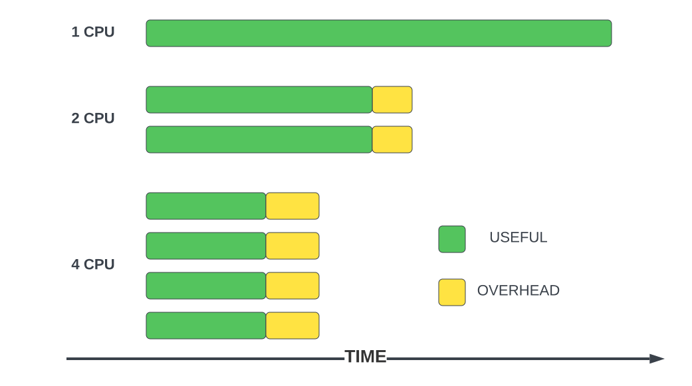

<!-- TODO: Add scaling example
Currently the rest of this lesson Not ready yet.  Too little info to go on without some sort of easy to grok exercise. -->

The aim of these tests will be to establish how a jobs requirements change with size (CPUs, inputs) and ultimately figure out the best way to run your jobs.

Unfortunately we cannot assume speedup will be linear (e.g. double CPUs won't usually half runtime, doubling the size of your input data won't necessarily double runtime) therefore more testing is required. This is called *scaling testing*.

In order to establish an understanding of the scaling properties we may have to repeat this test several times, giving more resources each iteration.

## Scaling Behavior

<!-- ### Diminishing Returns

Running code in parallel rarely comes for free, there are usually computational overheads. 
Whatever method is being used to distribute the workload usually require some computation, as well as communication between processes.

<!--  -->

This usually leads to diminishing returns when it comes to performance.

 -->

### Amdahl's Law

Most computational tasks will have a certain amount of work that must be computed serially.

<!-- 

As only the parallel portion of the job is sped up by scaling, the ratio of parallel to serial is an important factor in job scaling.  -->

Eventually your performance gains will plateau.

The fraction of the task that can be run in parallel determines the point of this plateau.
Code that has no serial components is said to be "embarrassingly parallel".

It is worth noting that Amdahl's law assumes all other elements of scaling are happening with 100% efficient, in reality there are additional computational and communication overheads.

> ## Scaling Exercise
>
> 1. Find your name in the [spreadsheet]({{ site.exercise }}) and modify your `example-job.sl` to request 
> "x" `--cpus-per-task`. For example `#SBATCH --cpus-per-task 10`.
> 2. Estimate memory requirement based on our previous runs and the cpus requested, memory 
> is specified with the `--mem ` flag, it does not accept decimal values, however you may 
> specify a unit (`K`|`M`|`G`), if no unit is specified it is assumed to be `M`. 
> For example `#SBATCH --mem 1200`. 
> 3. Submit the job with `sbatch --acctg-freq 1 example-job.sl`. 
> 4. Watch the job with `squeue --me` or `watch squeue --me`.
> 5. On completion of job, use `nn_seff <job-id>`.
> 6. Record the jobs "Elapsed", "TotalCPU", and "Memory" values in the spreadsheet. (Hint: They are the first 
> numbers after the percentage efficiency in output of `nn_seff`). Make sure you have entered the values in the correct format and there is a tick next to each entry. 
>
> > ## Solution
> > [spreadsheet]({{ site.exercise }})
> {: .solution}
{: .challenge}

> ## Scaling Exercise
>
> 1. Find your name in the [spreadsheet]({{ site.exercise }}) and modify your `example-job.sl` to request 
> "x" `--cpus-per-task`. For example `#SBATCH --cpus-per-task 10`.
> 2. Estimate memory requirement based on our previous runs and the cpus requested, memory 
> is specified with the `--mem ` flag, it does not accept decimal values, however you may 
> specify a unit (`K`|`M`|`G`), if no unit is specified it is assumed to be `M`. 
> For example `#SBATCH --mem 1200`. 
> 3. Submit the job with `sbatch --acctg-freq 1 example-job.sl`. 
> 4. Watch the job with `squeue --me` or `watch squeue --me`.
> 5. On completion of job, use `nn_seff <job-id>`.
> 6. Record the jobs "Elapsed", "TotalCPU", and "Memory" values in the spreadsheet. (Hint: They are the first 
> numbers after the percentage efficiency in output of `nn_seff`). Make sure you have entered the values in the correct format and there is a tick next to each entry. 
>
> > ## Solution
> > [spreadsheet]({{ site.exercise }})
> {: .solution}
{: .challenge}

<!-- > > ## Solution
> >
> >  1. No: `pwd` is not the name of a directory.
> >  2. Yes: `ls` without directory argument lists files and directories
> >     in the current directory.
> >  3. Yes: uses the absolute path explicitly.
> {: .solution}
{: .challenge} -->


